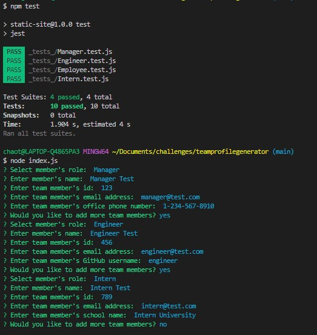
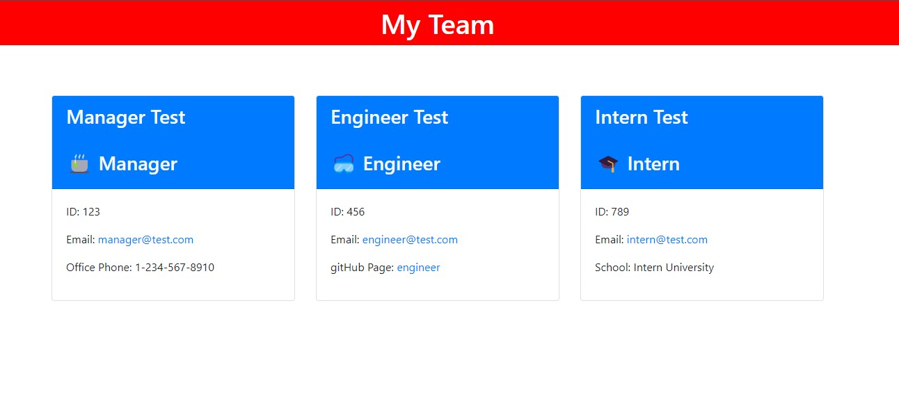

# Team Profile Generator
# Solution for Module 10 Challenge

This script has been created as a command line based tool for creating a README.md file.  It takes in user input and formats it using conventions expected in a professional README file.  Upon completion the information gathered is displayed, and a new file is created.   

  
[Click for demonstration video](https://fryylord.github.io/teamprofilegenerator/media/TeamProfileGenMovie.mp4)  
[Link to GitHub Repo](https://github.com/fryylord/teamprofilegenerator/)  

- [Installation](#installation)
- [Usage](#usage)
- [Credits](#credits)
- [License](#license)

## Installation

In the command line in the root directory, type npm install allowing for the required libraries to be installed

## Usage

After running the program the user is prompted with the following requests :

What is the project title?  
Describe your project  
Give instructions for installation  
How is thise site used?  
Who else should be credited on this site?  
Chose the appropriate license for this project  
What are some features of your site?  
What tests have you done?  
Who is the contact for the site?  
Please enter your GitHub username  
Please enter your email  

After this information is gathered, it is used to generate a readme.md file within the output directory.

## Credits

https://ku.bootcampcontent.com/ku-coding-boot-camp/KU-VIRT-FSF-PT-09-2022-U-LOLC/  
https://github.com/jpd61/README-generator  
https://www.james-fisher-web-developer.com/pages/readme-generator.html  
https://github.com/connietran-dev/readme-generator  

## License
 
MIT License

Copyright (c) 2022 fryylord

Permission is hereby granted, free of charge, to any person obtaining a copy
of this software and associated documentation files (the "Software"), to deal
in the Software without restriction, including without limitation the rights
to use, copy, modify, merge, publish, distribute, sublicense, and/or sell
copies of the Software, and to permit persons to whom the Software is
furnished to do so, subject to the following conditions:

The above copyright notice and this permission notice shall be included in all
copies or substantial portions of the Software.

THE SOFTWARE IS PROVIDED "AS IS", WITHOUT WARRANTY OF ANY KIND, EXPRESS OR
IMPLIED, INCLUDING BUT NOT LIMITED TO THE WARRANTIES OF MERCHANTABILITY,
FITNESS FOR A PARTICULAR PURPOSE AND NONINFRINGEMENT. IN NO EVENT SHALL THE
AUTHORS OR COPYRIGHT HOLDERS BE LIABLE FOR ANY CLAIM, DAMAGES OR OTHER
LIABILITY, WHETHER IN AN ACTION OF CONTRACT, TORT OR OTHERWISE, ARISING FROM,
OUT OF OR IN CONNECTION WITH THE SOFTWARE OR THE USE OR OTHER DEALINGS IN THE
SOFTWARE.

## Features

Command line interface  
Multiple libraries used  
Asychronous function(s)

## Tests

None
